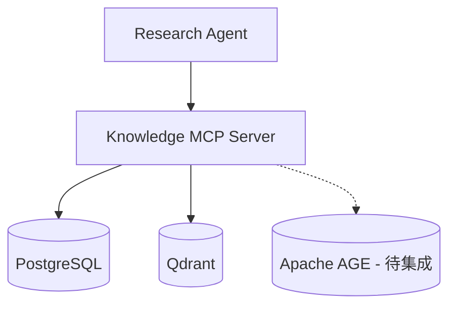

# Knowledge MCP Server 设计规范

> **ARCH 编号**：ARCH-005
> **状态**：Approved（已实现）
> **最后更新**：2026-08-01
> **规范名称**：Knowledge MCP Server（参见 `specs/agent-registry.yaml` §2）

---

## 1. 设计目标

Knowledge MCP Server 是 Research Agent 与知识存储的**标准访问层**。

**核心原则**：Agent 不直接访问 PostgreSQL / Qdrant / Apache AGE，而通过 MCP Tool 安全调用。



### 为什么需要 MCP Tool Layer

| 问题 | 直接访问存储 | 通过 MCP Tool |
|---|---|---|
| 安全 | Agent 可执行危险查询 | Tool 封装，参数校验 |
| 稳定 | LLM 生成 SQL/Cypher 不可靠 | 预定义查询模板 |
| 性能 | 容易全表扫描 | 内置 LIMIT + 缓存 |
| 审计 | 无法追踪查询意图 | Tool 调用日志 |
| 解耦 | Schema 变化影响 Agent | Tool 接口稳定 |

---

## 2. 技术栈

| 组件 | 选型 | 说明 |
|---|---|---|
| 框架 | **FastMCP 2** | Python MCP SDK |
| Transport | **Streamable HTTP** | 端口 `:8200` |
| 结构化存储 | **PostgreSQL** | asyncpg 连接池（5-30） |
| 向量存储 | **Qdrant** | 4 Collections |
| 缓存 | **cachetools TTLCache** | 进程内，TTL=60s，maxsize=1024 |
| 配置 | **Pydantic Settings** | 环境变量 + .env |

---

## 3. 代码目录结构

```
mcp-knowledge/
├── server/
│   ├── main.py              # FastMCP 入口 + 生命周期管理
│   ├── config.py            # MCPSettings（Pydantic Settings）
│   ├── cache.py             # KnowledgeCache（TTL 缓存单例）
│   ├── utils.py             # 序列化工具（UUID/时间字段）
│   ├── storage/
│   │   ├── postgres.py      # PostgreSQL 存储层（pg_storage 单例）
│   │   └── qdrant.py        # Qdrant 存储层（qdrant_storage 单例）
│   └── tools/
│       ├── entity.py        # Entity Tools（3 个）
│       ├── fact.py          # Fact Tools（3 个）
│       ├── semantic.py      # Semantic Tools（2 个）
│       ├── write.py         # Write Tools（4 个）
│       └── analysis.py      # Analysis Tools（3 个）
```

---

## 4. Tool API 总览（15 + 1）

| # | Tool | 模块 | 用途 | 缓存 |
|---|---|---|---|---|
| 1 | `search_entity` | Entity | 实体搜索（名称+类型） | ❌ |
| 2 | `get_entity` | Entity | 实体详情（by ID） | ✅ entity |
| 3 | `get_entity_graph` | Entity | 关系图谱遍历 | ✅ graph |
| 4 | `search_facts` | Fact | 事实查询（by 实体+谓词） | ❌ |
| 5 | `get_fact_history` | Fact | 事实版本历史 | ❌ |
| 6 | `get_timeline` | Fact | 事件时间线 | ❌ |
| 7 | `semantic_search` | Semantic | 向量语义检索 | ❌ |
| 8 | `similar_documents` | Semantic | 混合检索（并行 3 Collection） | ❌ |
| 9 | `create_entity` | Write | 创建实体 | 触发失效 |
| 10 | `create_fact` | Write | 创建事实 | 触发失效 |
| 11 | `create_relation` | Write | 创建关系 | 触发失效 |
| 12 | `update_knowledge` | Write | 版本化更新 | 触发失效 |
| 13 | `get_company_profile` | Analysis | 公司全景（并行聚合） | ✅ profile |
| 14 | `get_supply_chain` | Analysis | 供应链分析 | ✅ supply |
| 15 | `get_risk_factors` | Analysis | 风险因素聚合 | ❌ |
| 16 | `trace_event_impact` | Graph | 事件影响链追踪（AGE） | ❌ |
| 17 | `search_event` | Graph | 事件搜索 + 影响实体（AGE） | ❌ |
| — | `health_check` | System | 健康检查（Docker） | ❌ |

---

## 5. Entity Tools

### 5.1 `search_entity`

```python
async def search_entity(name: str = "", entity_type: str = "", limit: int = 10) -> list[dict]
```

| 参数 | 类型 | 说明 |
|---|---|---|
| `name` | str | 名称模糊匹配 |
| `entity_type` | str | 类型过滤（10 种） |
| `limit` | int | 返回上限 |

**Entity Types**：`Company / Person / Product / Technology / Industry / Country / Organization / Event / Metric / Concept`

**返回**：`[{id, name, entity_type, description, canonical_name, confidence, source_count}]`

---

### 5.2 `get_entity`

```python
async def get_entity(entity_id: str) -> dict
```

**返回**：实体完整信息 `{id, name, entity_type, description, canonical_name, aliases, properties, confidence, ...}`

**缓存**：`entity:{entity_id}`，TTL=60s

---

### 5.3 `get_entity_graph`

```python
async def get_entity_graph(entity: str, depth: int = 2) -> dict
```

| 参数 | 类型 | 说明 |
|---|---|---|
| `entity` | str | 实体名称（如 "NVIDIA"） |
| `depth` | int | 遍历深度（1-2） |

**返回**：

```json
{
  "nodes": [{"id": "uuid", "name": "NVIDIA", "entity_type": "Company"}],
  "edges": [{"source": "uuid", "target": "uuid", "relation_type": "supplier", "confidence": 0.92, "depth": 1}]
}
```

**实现**：PostgreSQL 递归 CTE（Apache AGE 集成后将迁移至 Cypher）

**缓存**：`graph:{entity}:{depth}`，TTL=60s

---

## 6. Fact Tools

### 6.1 `search_facts`

```python
async def search_facts(entity: str, topic: str = "", limit: int = 20) -> dict
```

**返回**：

```json
{
  "entity": {"id": "uuid", "name": "NVIDIA"},
  "facts": [{"id": "uuid", "predicate": "revenue", "object_value": "26.9B", "unit": "USD", "time_start": "2026-01-01", "confidence": 0.95, "verification_status": "auto", "source_title": "..."}],
  "count": 5
}
```

---

### 6.2 `get_fact_history`

```python
async def get_fact_history(fact_id: str) -> dict
```

**返回**：`{fact_id, versions: [{version, content, created_by, created_at}], count}`

---

### 6.3 `get_timeline`

```python
async def get_timeline(entity: str, limit: int = 20) -> dict
```

**返回**：`{entity: {id, name}, events: [{id, event_type, title, description, event_date, impact, confidence}], count}`

---

## 7. Semantic Tools

### 7.1 `semantic_search`

```python
async def semantic_search(query: str, collection: str = "chunks", top_k: int = 10) -> dict
```

| 参数 | 类型 | 说明 |
|---|---|---|
| `query` | str | 自然语言查询 |
| `collection` | str | 目标 Collection |
| `top_k` | int | 返回数量 |

**Collections**：`chunks / entities / facts / reports`

**Embedding**：Qwen3-Embedding-4B（2560 维）

**返回**：`{collection, results: [{id, score, payload}], count}`

---

### 7.2 `similar_documents`

```python
async def similar_documents(query: str, top_k: int = 10) -> dict
```

**实现**：`asyncio.gather` 并行搜索 entities + facts + chunks 三个 Collection

**返回**：`{entities: [...], facts: [...], chunks: [...]}`

---

## 8. Write Tools

### 8.1 `create_entity`

```python
async def create_entity(
    name: str, entity_type: str, description: str = "",
    canonical_name: str = "", aliases: list[str] | None = None,
    properties: dict | None = None, confidence: float = 1.0,
) -> dict
```

**返回**：`{id, name, status: "created"}`

**副作用**：失效 `entity:` / `graph:` / `profile:` 缓存

---

### 8.2 `create_fact`

```python
async def create_fact(
    subject_entity: str, predicate: str, object_value: dict,
    unit: str = "", time_start: str = "", time_end: str = "",
    source_document: str = "", confidence: float = 1.0,
) -> dict
```

**返回**：`{id, predicate, status: "created"}`

---

### 8.3 `create_relation`

```python
async def create_relation(
    source_entity: str, target_entity: str, relation_type: str,
    confidence: float = 1.0, properties: dict | None = None,
) -> dict
```

**Relation Types**（10 种）：`supplier / customer / competitor / depends_on / owns / uses / invests_in / located_in / impacts / causes`

**返回**：`{id, relation_type, status: "created"}`

---

### 8.4 `update_knowledge`

```python
async def update_knowledge(object_type: str, object_id: str, updates: dict) -> dict
```

| 参数 | 类型 | 说明 |
|---|---|---|
| `object_type` | str | `entity` 或 `fact` |
| `object_id` | str | UUID |
| `updates` | dict | 更新字段（如 `{"confidence": 0.9}`） |

**版本化**：更新前自动保存快照到 `audit.knowledge_versions`

**返回**：`{object_id, object_type, status: "updated"}`

---

## 9. Analysis Tools

### 9.1 `get_company_profile`

```python
async def get_company_profile(entity: str) -> dict
```

**实现**：`asyncio.gather` 并行 4 路查询（基本信息 + 关系 + 事实 + 事件）

**返回**：

```json
{
  "entity": {"id": "...", "name": "NVIDIA", "entity_type": "Company", ...},
  "relations": [{"target": "uuid", "relation_type": "supplier", "confidence": 0.9}],
  "facts": [{"predicate": "revenue", "object_value": "26.9B", "time_start": "...", "confidence": 0.95}],
  "events": [{"title": "AI Export Restriction", "event_date": "2026-07-31", "event_type": "regulation"}]
}
```

**缓存**：`profile:{entity}`，TTL=60s

---

### 9.2 `get_supply_chain`

```python
async def get_supply_chain(entity: str) -> dict
```

**供应链关系类型**：`supplier / customer / supplies / depends_on`

**返回**：

```json
{
  "entity": {"id": "uuid", "name": "NVIDIA"},
  "suppliers": [{"id": "...", "name": "TSMC", "type": "Company", "relation": "supplier", "confidence": 0.9}],
  "customers": [...],
  "dependencies": [...]
}
```

**缓存**：`supply:{entity}`，TTL=60s

---

### 9.3 `get_risk_factors`

```python
async def get_risk_factors(entity: str) -> dict
```

**聚合**：低置信度事实 + 知识冲突

**返回**：

```json
{
  "entity": {"id": "uuid", "name": "NVIDIA"},
  "low_confidence_facts": [{"id": "...", "predicate": "...", "confidence": 0.3}],
  "conflicts": [{"id": "...", "conflict_type": "...", "fact_a": "...", "fact_b": "..."}],
  "summary": "发现 3 个潜在风险项（2 低置信度事实, 1 知识冲突）"
}
```

---

## 10. 缓存策略

| 策略 | 适用 Tool | 说明 |
|---|---|---|
| **缓存** | get_entity, get_entity_graph, get_company_profile, get_supply_chain | 变更频率低 / 聚合代价高 |
| **不缓存** | search_*, semantic_search, get_timeline, get_risk_factors | 查询组合多 / 实时性要求高 |
| **触发失效** | create_*, update_knowledge | 写后按前缀失效相关缓存 |

**配置**：

```python
CACHE_TTL_SECONDS = 60      # 缓存存活时间
CACHE_MAX_SIZE = 1024       # 最大缓存条目
CACHE_ENABLED = True        # 全局开关
```

---

## 11. 存储层设计

### PostgreSQL（pg_storage 单例）

| 配置 | 值 |
|---|---|
| 连接池 | min=5, max=30 |
| Statement Timeout | 15000ms |
| 数据库 | `ai` |

### Qdrant（qdrant_storage 单例）

| Collection | 内容 |
|---|---|
| `chunks` | 文档分片向量 |
| `entities` | 实体名称+描述向量 |
| `facts` | 事实语义向量 |
| `reports` | 研究报告向量 |

### Apache AGE（待集成）

当前图遍历由 PostgreSQL 递归 CTE 完成。待 AGE 集成后：
- `get_entity_graph` → Cypher 多跳遍历
- 新增 `trace_event_impact` → 事件影响链
- 新增 `search_event` → 事件图查询

---

## 12. Research Agent 调用流程

用户：*"美国限制 AI 芯片出口，对 NVIDIA 有什么影响？"*


| Step | Tool | 目的 |
|---|---|---|
| 1 | `search_entity` | 确认实体存在 |
| 2 | `get_entity_graph` | 获取关系网络 |
| 3 | `get_supply_chain` | 供应链依赖 |
| 4 | `get_risk_factors` | 风险聚合 |
| 5 | `semantic_search` | 语义补充 |

---

## 13. 架构约束

遵循 `specs/architecture.yaml` MCP Server 约束：

| 约束 ID | 规则 |
|---|---|
| MCP-001 | Tool 不含业务逻辑（只封装存储查询） |
| MCP-002 | Tool 通过 storage/ 访问数据库（禁止直连） |
| MCP-003 | 工具注册集中在 tools/*.py（禁止 main.py 内联） |
| MCP-004 | 响应格式统一（dict + count/data，错误返回 {error}） |

---

## 14. 规划中扩展 Tool

| Tool | 用途 | 依赖 |
|---|---|---|
| `trace_event_impact` | 事件影响链（Policy→Industry→Companies） | Apache AGE |
| `search_event` | 事件搜索 + 影响公司 | Apache AGE |
| `compare_companies` | 竞争对比分析 | — |
| `detect_market_signal` | 市场信号发现 | — |
| `generate_graph_context` | 生成 LLM Graph Context | — |

---

## 15. 核心价值

```
Knowledge Intelligence Layer = Graph Memory + Vector Memory + Financial Facts
```

| 组件 | 作用 |
|---|---|
| PostgreSQL | 保存结构化事实 |
| Qdrant | 语义向量检索 |
| Apache AGE（待集成） | 图遍历 + 影响链 |
| MCP Server | 让 Agent 安全、标准化地调用知识 |

---

## 变更历史

| 日期 | 版本 | 变更内容 |
|---|---|---|
| 2026-08-01 | v2.1 | 新增 Graph Tools（trace_event_impact + search_event），集成 Apache AGE |
| 2026-08-01 | v2.0 | 全面重写：对齐实际 15 Tools × 5 模块实现，移除 Apache AGE 依赖描述 |
| 2026-07-xx | v1.0 | 初版：9 个 Graph Tools 设计（基于 Apache AGE） |
