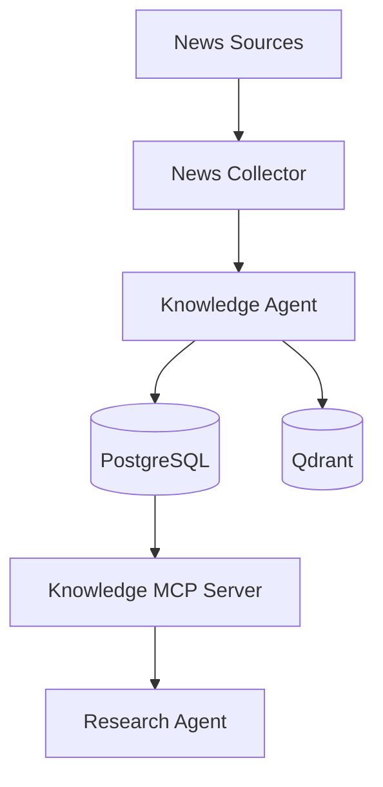

# Design Document 结构模板规范

## 1. 目的

统一 `docs/design/` 下所有设计文档的结构，确保每份文档可独立指导开发落地，并支持交叉审查。

> 本规范填补审查报告中 S3（统一文档结构模板）的空白。

---

## 2. 强制章节结构

每份设计文档 **必须** 包含以下章节（可选章节标注 `[可选]`）：

```markdown
# {文档标题}

> **ARCH 编号**：ARCH-XXX（与 invenst_platform.md 索引对齐）
> **状态**：Draft / Review / Approved / Deprecated
> **最后更新**：YYYY-MM-DD
> **维护者**：{团队或个人}

## 1. 设计目标
- 一段话说明本模块解决什么问题
- 不解决什么问题（明确排除）

## 2. 在整体架构中的位置
- Mermaid 数据流图（必须，不能只有文本框图）
- 上下游依赖组件列表
- 引用 `specs/agent-registry.yaml` 中的规范名称

## 3. 接口定义
- 输入/输出 Schema（JSON Schema 或 TypedDict）
- API 端点或 Tool 签名
- 错误码定义

## 4. 存储设计
- 使用哪些存储（引用 agent-registry.yaml §5）
- 表结构 / Collection 定义
- 数据生命周期

## 5. 工作流 [可选]
- State 结构定义
- 节点职责表
- 数据流向图

## 6. 错误处理
- 重试策略
- 降级方案
- Dead Letter Queue

## 7. 监控与告警
- 引用 `monitoring-sla-spec.md` 或定义额外指标
- SLA 目标

## 8. 约束与限制
- 已知限制
- 与 architecture.yaml 约束的关系

## 9. 变更历史
| 日期 | 版本 | 变更内容 | 作者 |
|---|---|---|---|
```

---

## 3. 命名规范

### 3.1 组件引用

所有组件引用 **必须** 使用 `specs/agent-registry.yaml` 中的规范名称。

**禁止**：
- ❌ "Knowledge Graph Ingestion Agent"（历史名称）
- ❌ "news_ingestion_agent"（代码目录名风格）

**正确**：
- ✅ "**Knowledge Agent**"（规范名称）
- ✅ "`knowledge_agent/`"（代码目录名引用时使用 backtick）

### 3.2 存储引用

引用存储方案时，必须明确当前实际方案：

| 场景 | 写法 |
|---|---|
| 描述现有实现 | "PostgreSQL（结构化数据）+ Qdrant（向量）" |
| 描述规划方案 | "MinIO（原始文件归档，**规划中**）" |
| 描述已集成方案 | "Apache AGE（图存储，**已集成**，PG CTE 作为 Fallback）" |
| 描述废弃方案 | "~~pgvector~~（已废弃，向量存储由 Qdrant 负责）" |

### 3.3 类型枚举

所有 entity_type / relation_type / event_type 枚举：

- 引用权威来源 `specs/ontology.yaml`（待创建）
- 设计文档中 **禁止** 独立定义类型枚举
- 如需扩展，必须同步更新 ontology.yaml

---

## 4. 架构图规范

### 4.1 必须使用 Mermaid



### 4.2 禁止项

- ❌ 纯文本 ASCII 框图（不可维护）
- ❌ 手绘图片（不可搜索）
- ✔️ 包含 Apache AGE 的架构图（已集成，需标注 Fallback 机制）

---

## 5. 文档生命周期

| 状态 | 含义 | 允许操作 |
|---|---|---|
| **Draft** | 初稿，未经审查 | 自由修改 |
| **Review** | 审查中 | 仅响应审查意见修改 |
| **Approved** | 已批准，可指导开发 | 变更需 PR 审查 |
| **Deprecated** | 已废弃 | 仅保留历史记录，禁止引用 |

---

## 6. 审查 Checklist

每次设计文档 PR 时，自动检查：

- [ ] ARCH 编号已在 `invenst_platform.md` 注册
- [ ] 使用 `agent-registry.yaml` 规范名称
- [ ] 包含 Mermaid 架构图
- [ ] 包含错误处理章节
- [ ] 包含监控告警引用
- [ ] 类型枚举引用 `ontology.yaml`
- [ ] 无 pgvector 引用（已废弃）
- [ ] Apache AGE 引用标注为「已集成」+ Fallback 说明
