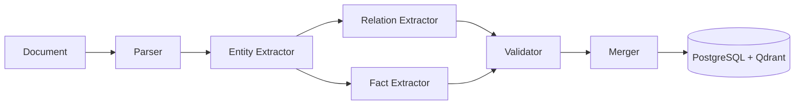
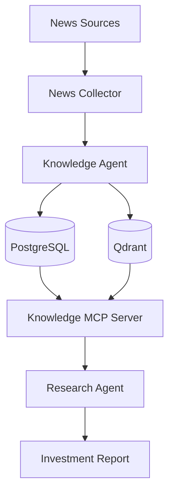
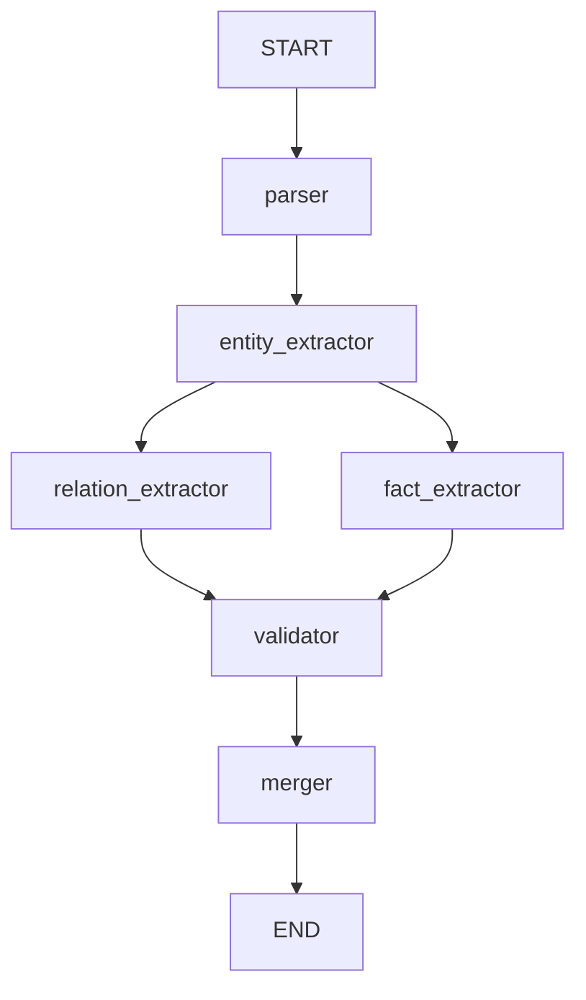
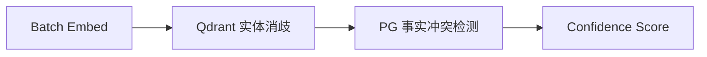
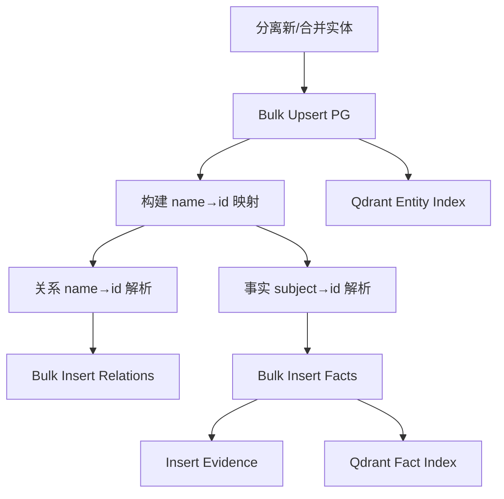

# Knowledge Agent 设计

> **ARCH 编号**：ARCH-003
> **状态**：Approved（已实现）
> **最后更新**：2026-08-01
> **规范名称**：Knowledge Agent（参见 `specs/agent-registry.yaml`）

---

## 1. 设计目标

**将非结构化文档自动转换为结构化投资知识，写入 PostgreSQL + Qdrant。**

### 核心流程



### 不做什么

- 不负责新闻采集（由 News Intelligence Agent 规划中）
- 不负责知识生命周期管理（由 Knowledge Maintenance Agent 规划中）
- 不直接生成 Cypher（Apache AGE 待集成后由 MCP Server 负责）

---

## 2. 在整体 AI Platform 中的位置



| 上游 | 本模块 | 下游 |
|---|---|---|
| News Collector / 文档输入 | **Knowledge Agent** | Knowledge MCP Server → Research Agent |

---

## 3. 为什么需要独立 Knowledge Agent？

**不要：** 新闻 → 直接写 Graph

**原因：** 新闻不是知识。

**例如：**

> 新闻：*NVIDIA announces partnership with TSMC for next generation AI chips*

**需要转换：**

```
原文：NVIDIA announces partnership with TSMC
  ↓
实体：NVIDIA / TSMC / AI Chip
  ↓
关系：NVIDIA —supplier→ TSMC
  ↓
事实：NVIDIA.revenue = $26.9B (2026Q1)
  ↓
存储：PostgreSQL（结构化）+ Qdrant（向量）
```

---

## 4. LangGraph Workflow 设计

### 4.1 拓扑结构：Fan-out / Fan-in 并行



**设计决策**：Relation 和 Fact 提取彼此无数据依赖（都只依赖 Entity 结果 + chunks），
因此采用 fan-out/fan-in 并行执行，减少端到端延迟约 30-40%。

### 4.2 实际代码定义

```python
# knowledge_agent/graph.py
def build_knowledge_organization_graph():
    graph = StateGraph(KnowledgeState)

    graph.add_node("parser", _timed("parser")(document_parser))
    graph.add_node("entity_extractor", _timed("entity_extractor")(entity_extractor))
    graph.add_node("relation_extractor", _timed("relation_extractor")(relation_extractor))
    graph.add_node("fact_extractor", _timed("fact_extractor")(fact_extractor))
    graph.add_node("validator", _timed("validator")(knowledge_validator))
    graph.add_node("merger", _timed("merger")(knowledge_merger))

    graph.add_edge(START, "parser")
    graph.add_edge("parser", "entity_extractor")

    # Fan-out: Entity 完成后并行
    graph.add_edge("entity_extractor", "relation_extractor")
    graph.add_edge("entity_extractor", "fact_extractor")

    # Fan-in: 两者完成后进入 Validator
    graph.add_edge("relation_extractor", "validator")
    graph.add_edge("fact_extractor", "validator")

    graph.add_edge("validator", "merger")
    graph.add_edge("merger", END)

    return graph.compile()
```

---

## 5. State 设计

```python
# knowledge_agent/state.py
class KnowledgeState(TypedDict):
    # ── 输入 ──
    document_id: str
    document_type: str
    raw_text: str
    source_metadata: dict

    # ── 分片 ──
    chunks: list[dict]

    # ── 提取结果 ──
    entities: list[dict]
    relations: list[dict]
    facts: list[dict]
    evidence: list[dict]

    # ── 校验 ──
    conflicts: list[dict]
    confidence_score: float

    # ── 性能优化：Embedding 缓存（Validator 计算，Merger 复用） ──
    entity_embeddings: list[list[float]]

    # ── 存储追踪 ──
    stored_entity_ids: list[str]
    stored_fact_ids: list[str]

    # ── 控制（并行安全：fan-out 分支的错误自动累加，不覆盖） ──
    errors: Annotated[list[str], operator.add]
```

**关键设计点**：
- `errors` 使用 `Annotated[list[str], operator.add]` 确保 fan-out 并行分支的错误自动累加而非覆盖
- `entity_embeddings` 由 Validator 计算后写入 State，Merger 直接复用（避免重复 embed）
- 非对话型 Agent，不含 `messages` 字段

---

## 6. Node 设计

### Node 1：Parser（文档解析与分片）

| 项目 | 说明 |
|---|---|
| **文件** | `nodes/parser.py` |
| **输入** | `raw_text` |
| **输出** | `chunks: list[dict]` |
| **依赖** | `tools/chunker.py`, `config/policy_loader.py` |

**职责**：
- 将原始文本分片为 chunks（Markdown 感知分片）
- 大文档保护：超过 `max_chunks_per_document`（默认 200）时截断

---

### Node 2：Entity Extractor（实体提取）

| 项目 | 说明 |
|---|---|
| **文件** | `nodes/entity.py` |
| **输入** | `chunks` |
| **输出** | `entities: list[dict]` |
| **Prompt** | `prompts/knowledge/entity_extraction.md` |
| **并发** | Semaphore 限流（默认 max_concurrent_llm=4） |

**输出 Schema**：

```json
{
  "name": "NVIDIA",
  "entity_type": "Company",
  "description": "AI chip manufacturer",
  "aliases": ["NVDA", "英伟达"],
  "properties": {"ticker": "NVDA", "exchange": "NASDAQ"}
}
```

**Entity Types**（10 种）：
`Company / Person / Product / Technology / Industry / Country / Organization / Event / Metric / Concept`

**去重策略**：by `(name.lower(), entity_type)` 内存去重

---

### Node 3：Relation Extractor（关系提取）— 并行分支 A

| 项目 | 说明 |
|---|---|
| **文件** | `nodes/relation.py` |
| **输入** | `entities` + `chunks` |
| **输出** | `relations: list[dict]` |
| **Prompt** | `prompts/knowledge/relation_extraction.md` |
| **校验** | source/target 必须在已识别实体中 |

**输出 Schema**：

```json
{
  "source": "NVIDIA",
  "target": "TSMC",
  "relation_type": "supplier",
  "confidence": 0.92,
  "properties": {}
}
```

**Relation Types**（10 种）：
`supplier / customer / competitor / depends_on / owns / uses / invests_in / located_in / impacts / causes`

**去重策略**：by `(source.lower(), relation_type, target.lower())`

---

### Node 4：Fact Extractor（事实提取）— 并行分支 B

| 项目 | 说明 |
|---|---|
| **文件** | `nodes/fact.py` |
| **输入** | `entities` + `chunks` |
| **输出** | `facts: list[dict]` + `evidence: list[dict]` |
| **Prompt** | `prompts/knowledge/fact_extraction.md` |
| **校验** | subject 必须在已识别实体中 |

**Fact Schema**：

```json
{
  "subject": "NVIDIA",
  "predicate": "revenue",
  "object_value": "26.9B",
  "unit": "USD",
  "time_start": "2026-01-01",
  "time_end": "2026-03-31",
  "confidence": 0.95
}
```

**Evidence Schema**：

```json
{
  "location": "chunk_3",
  "quote": "NVIDIA reported revenue of $26.9 billion...",
  "confidence": 0.95
}
```

**去重策略**：by `(subject.lower(), predicate.lower(), str(object_value))`

---

### Node 5：Validator（知识校验）

| 项目 | 说明 |
|---|---|
| **文件** | `nodes/validator.py` |
| **输入** | `entities` + `facts` |
| **输出** | `conflicts`, `confidence_score`, `entity_embeddings` |
| **依赖** | `storage/postgres.py`, `storage/qdrant.py`, `tools/embedding.py` |

**三阶段校验**：



1. **批量 Embed**：实体名称 → 向量（结果写入 State 供 Merger 复用）
2. **实体消歧**：Qdrant 向量检索已有实体，相似度 ≥ 0.85 时标记为合并
3. **事实冲突检测**：批量查询同 subject+predicate 不同 value 的事实

**性能优化**：
- 实体消歧从 PG 全表扫描 → Qdrant 向量检索
- 事实冲突检测从 N+1 查询 → `ANY($1)` 批量查询
- Embeddings 写入 State 供 Merger 复用（避免重复计算）

**置信度公式**：

```
confidence = max(0.0, 1.0 - conflicts × 0.1 - merges × 0.02)
```

---

### Node 6：Merger（知识合并与存储）

| 项目 | 说明 |
|---|---|
| **文件** | `nodes/merger.py` |
| **输入** | `entities`, `relations`, `facts`, `evidence`, `entity_embeddings` |
| **输出** | `stored_entity_ids`, `stored_fact_ids` |
| **依赖** | `storage/postgres.py`, `storage/qdrant.py` |

**写入流程**：



**关键设计**：
- 复用 Validator 的 `entity_embeddings`（避免重复 embed）
- 已有 `existing_id` 的实体 → 更新（ON CONFLICT 合并）
- 关系/事实中的实体名称 → 通过 `name_to_id` 映射解析为 UUID
- Qdrant 索引失败不阻塞主流程（降级为仅 PG 存储）

---

## 7. 代码目录结构

```
langgraph/agent/
├── agents/
│   └── knowledge_agent.py          # Agent 注册入口
├── knowledge_agent/
│   ├── graph.py                    # StateGraph 定义（fan-out/fan-in）
│   ├── state.py                    # KnowledgeState TypedDict
│   ├── nodes/
│   │   ├── parser.py              # Node 1: 文档分片
│   │   ├── entity.py             # Node 2: 实体提取
│   │   ├── relation.py           # Node 3: 关系提取（并行 A）
│   │   ├── fact.py               # Node 4: 事实提取（并行 B）
│   │   ├── validator.py          # Node 5: 校验 + 消歧
│   │   └── merger.py             # Node 6: 合并 + 存储
│   └── storage/
│       ├── postgres.py           # PostgreSQL 批量操作
│       └── qdrant.py             # Qdrant 向量索引
├── prompts/knowledge/
│   ├── entity_extraction.md
│   ├── relation_extraction.md
│   ├── fact_extraction.md
│   └── validation.md
├── tools/
│   ├── llm.py                    # LLM 调用封装
│   ├── embedding.py              # Embedding 封装
│   └── chunker.py                # Markdown 分片
└── config/
    └── policy_loader.py          # 策略配置加载
```

---

## 8. 存储设计

| 存储 | 职责 | 写入内容 |
|---|---|---|
| **PostgreSQL** | 结构化事实真相源 | entities, relations, facts, evidence |
| **Qdrant** | 向量语义检索 | entity embeddings, fact embeddings |
| **Apache AGE**（待集成） | 图遍历 | 当前由 PG 递归 CTE 临时替代 |

> 参见 `specs/agent-registry.yaml` §5 存储职责边界

---

## 9. 与 Knowledge MCP Server 集成

Knowledge Agent 写入后，MCP Server 提供 15 个 Tools 供 Research Agent 查询：

| 模块 | Tools | 说明 |
|---|---|---|
| Entity | `search_entity`, `get_entity`, `get_entity_graph` | 实体搜索/详情/图遍历 |
| Fact | `search_facts`, `get_fact_history`, `get_timeline` | 事实查询/版本/时间线 |
| Semantic | `semantic_search`, `similar_documents` | Qdrant 向量检索 |
| Analysis | `get_company_profile`, `get_supply_chain`, `get_risk_factors` | 分析聚合 |
| Write | `create_entity`, `create_fact`, `create_relation`, `update_knowledge` | 知识写入 |

---

## 10. 生产级设计

### 10.1 性能监控

所有节点通过 `_timed` 装饰器采集耗时：

```python
@_timed("entity_extractor")
async def entity_extractor(state: dict) -> dict: ...
```

> SLA 指标参见 `docs/design/monitoring-sla-spec.md`

### 10.2 并发控制

- LLM 调用：`asyncio.Semaphore(max_concurrent_llm=4)` 限流
- Qdrant 检索：`asyncio.gather` 并行
- PG 批量操作：`bulk_upsert` / `bulk_insert` 减少 round-trip

### 10.3 错误处理

- `errors: Annotated[list[str], operator.add]` 确保并行分支错误累加
- 单 chunk 提取失败不阻塞整体（降级为空结果 + 记录错误）
- Qdrant 索引失败不阻塞 PG 写入（降级为仅结构化存储）

### 10.4 Confidence Score

所有知识保存置信度元数据：

```json
{
  "confidence": 0.93,
  "source_document": "doc_uuid",
  "verification_status": "auto"
}
```

### 10.5 Event Versioning（规划中）

事件随时间演变，通过 SUPERSEDES 边链式记录：

```
Event1 —SUPERSEDES→ Event2
```

> 待 Apache AGE 集成后实现图结构版本链。

---

## 11. 规划中扩展节点

以下节点在设计中规划但尚未实现：

| 节点 | 职责 | 插入位置 |
|---|---|---|
| Entity Linker | Registry + Embedding + LLM 三阶段消歧 | entity_extractor 之后 |
| Event Extractor | 事件类型识别 + 影响分析 | 与 relation/fact 并行 |
| Impact Analyzer | 行业/市场影响评估 | event_extractor 之后 |
| Graph Indexer | Apache AGE Cypher 写入 | merger 之后 |

---

## 12. 核心价值

本 Agent 完成从原始文档到投资知识的全链路转化：

```
文档 → 分片 → 实体 → 关系 + 事实 → 校验 → 存储
```

| 层级 | 能力 |
|---|---|
| **RAG** | 找资料 |
| **Knowledge Graph** | 理解世界 |
| **Research Agent** | 做投资判断 |

> **Knowledge Agent** 是连接 **文档输入 → PostgreSQL/Qdrant → MCP Knowledge Server → Research Agent** 的核心生产管线。

---

## 变更历史

| 日期 | 版本 | 变更内容 |
|---|---|---|
| 2026-08-01 | v2.0 | 全面重写：反映实际 6 节点 fan-out/fan-in 架构，对齐代码实现 |
| 2026-07-xx | v1.0 | 初版：8 节点线性流水线设计（已废弃） |
